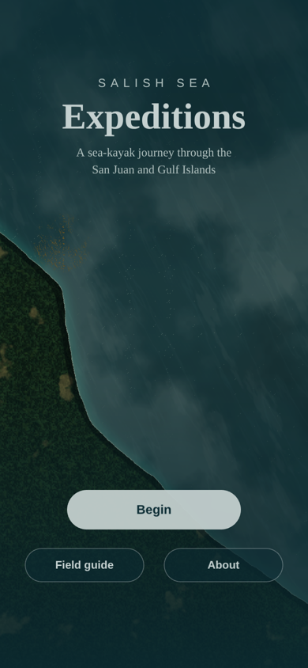
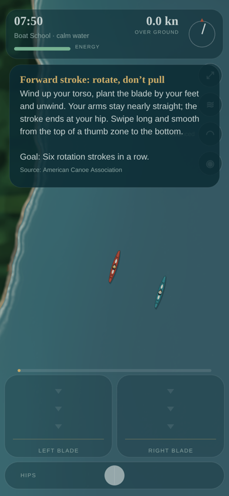
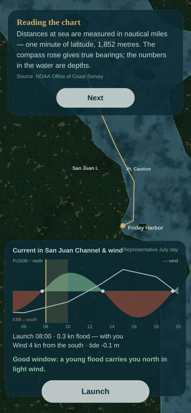
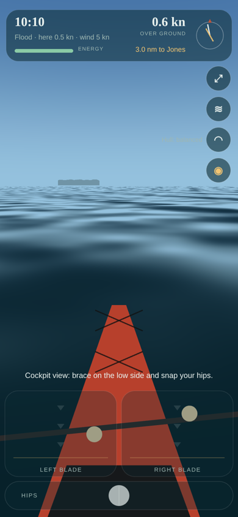

<p align="center">
  
  
  
  
</p>

# Salish Sea Expeditions

A sea-kayak expedition through the San Juan and Gulf Islands, paddled in a folding kayak. It is a
game, and it is also a way to become a stronger sea kayaker: every scene teaches something true —
about paddling, about the animals and plants of the Salish Sea, about the island communities, and
about the Coast Salish peoples whose homelands these waters are.

**Mobile-first** (iPhone Safari, portrait) · **Phaser 4** · every image and sound is generated in
code · web-deployed (Cloud Run + Terraform, coming in its own feature).

> A game is not a substitute for instruction. Learn rescues with a qualified instructor, paddle
> with others, and check real tide and current predictions. The chart here is simplified — do not
> use it for navigation.

## First Voyage (what is playable now)

Friday Harbor → Jones Island, about 4½ nautical miles, one night out.

1. **A place of First Peoples** — the game opens with a land acknowledgment (draft, pending review
   with the Nations named) and a safety note.
2. **Walk-on ferry from Anacortes**, or start in Friday Harbor. Spot the islands from the deck.
3. **Kayak School** — the kayak's anatomy (frame, skin, hull jacks, flotation bags, coaming, skirt),
   how you *wear* a kayak (feet, knees, hips, backband, head), the paddle, then calm-water drills:
   rotation strokes, edging, sweeps on edge, the low brace and hip snap.
4. **Assemble** the folding kayak — the history of the skin-on-frame kayak plays while the frame
   goes together. Rush the tensioning and the hull wanders.
5. **Pack** through the cockpit into the flotation bags; trim matters; forgotten gear stays forgotten.
6. **Plan** the launch from the day's current and wind: slack water, the young flood, wind against
   tide.
7. **The crossing** with a computer-controlled partner: ferry angle against the current, eddies
   and kelp to rest in, a tide rip off Point Caution (with a cockpit-view prototype), the Friday
   Harbor ferry, hauled-out seals and a pod of orcas under Be Whale Wise rules.
8. **Capsize and rescue** — roll, paddle-float re-entry, re-entry without a float, or a T-rescue,
   step by step against the 1-10-1 cold-water clock.
9. **Camp** above the night's high water, keep the food from Jones Island's raccoons, leave no
   trace, see the water glow at night — and explore the tide pools at the morning low.
10. **Debrief** — miles, nights, score, skills, lessons, species; share the trip.

### Controls

| Do this | On the phone | Keyboard |
| --- | --- | --- |
| Forward stroke | Swipe down a blade zone — long and smooth, from the top to the hip line, is torso rotation | A / D or ← → |
| Reverse stroke | Swipe up a blade zone | S or ↓ |
| Sweep turn | Swipe outward across a blade zone | Z / C |
| Edge (lift a knee) | Drag the hips bar | Q / E (hold) |
| Brace | Hold a thumb still on the low side's blade zone… | J / L (hold) |
| Hip snap | …and flick the hips bar back toward the centre | K |

## Godot rewrite (experiment branch)

`experiment/godot-rewrite` carries a ground-up Godot 4.5 version of the game in `godot/`: a true
3D sea the kayak floats on, the same hull lines, the same stroke rules and the same touch
vocabulary. It is an experiment with a go/no-go in `specs/007-godot-rewrite/spec.md`; the Phaser
game on `main` stays the shipped game until the Godot one is better on a phone.

```bash
godot --path godot                                               # open in the editor
godot --headless --path godot --import                           # once, so the class cache knows the scripts
godot --headless --path godot -s res://tests/run_tests.gd        # unit tests
godot --headless --path godot -s res://tests/debug_scenes.gd     # every scene instantiates headless
godot --headless --path godot --export-release Web ../build/web/index.html
mkdir -p build/web/audio && cp godot/audio/piece_*.mp3 build/web/audio/   # the music rides beside the pack
node tests/smoke/godot-desktop-shot.mjs build/web '?scene=trip'  # headless Chromium smoke of the export
node server/precompress.mjs build/web                            # brotli/gzip siblings, as the image does
STATIC_DIR=build/web node server/server.mjs                      # serve it on :8080
```

The game is a three-day sea-kayak expedition on the real islands: the opening (title,
acknowledgment, outfitting, the ferry from Anacortes, Kayak School), then for each day a float plan
on the chart with the day's water as a graph, the leg on the water with a partner, the ferry,
wildlife, tide and rips, and camp or the take-out ashore. Content is exported from `src/content`
by `tools/export-content.mjs`, the legs are laid over the water by `tools/geo/leg_routes.py`,
sounds come from `tools/synth-audio.mjs` and four full-length pieces from `tools/synth-pieces.mjs`.
`?scene=plan|trip|camp|guide`, `?leg=0|1|2` and `?near=jones|spieden|posey|ferry` open a station
or a spot for checks; `specs/007-godot-rewrite/tasks.md` lists every slice.

Needs Godot 4.5 and its web export templates (`.github/workflows/godot.yml` shows the install).

## Run it

```bash
npm install
npm run dev       # http://localhost:5173 — open on your phone on the same network
npm test          # rules and content (node:test)
npm run build
npm run smoke     # headless iPhone-sized pass through every scene, screenshots in tests/smoke/out
```

Jump straight to a scene while developing: `?scene=Paddle&mode=trip`, `?scene=Planning`, …

## Put it on a phone

It deploys to Google Cloud Run the same way Plumber Wars does — see [`infra/README.md`](infra/README.md):

```bash
bash deploy/cloud-run.sh YOUR_PROJECT_ID us-west1 twknab/salish-sea-expeditions
```

One command creates the registry and the public service and prints the URL. With the three
secrets it prints, every green merge to `main` redeploys itself (keyless).

## How it is built

- `src/sim/` — tides, currents, wind, kayak physics, stability and bracing, energy, cold water,
  rescues, packing, assembly, wildlife rules, camp, score, save, the partner AI. Pure functions, no
  Phaser, all tested.
- `src/content/` — lessons, species, anatomy, gear, places, the acknowledgment and every source
  in `credits.js`: reviewable by an instructor, a naturalist or a cultural reviewer without reading
  game code.
- `src/render/` — the world shader (water, islands, light, fog, kelp, rips), the cockpit-view
  shader, procedural kayak and wildlife art.
- `src/audio/soundscape.js` — synthesised sea, wind, strokes, orca blows, eagles, the ferry horn.
- `specs/001-first-voyage/` — the spec, plan, research, contracts and tasks (Spec Kit).
- `.specify/memory/constitution.md` — the principles every feature is judged against.

## Known gaps (tracked)

- Island outlines are hand-authored approximations and the tide day is a realistic example — NOAA
  and USGS were unreachable from the build environment. Both are isolated for a data swap.
- Facts marked ◇ on the Credits screen still need checking against their sources.
- The land acknowledgment and any cultural content need review with the Nations named.
- The folding kayak's brand name waits for the manufacturer's permission.
- Sounds are synthesised; licensed field recordings can replace them voice by voice.
- Deployment is written and checked locally but has not been applied — it needs your GCP project.
